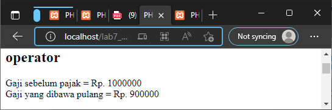
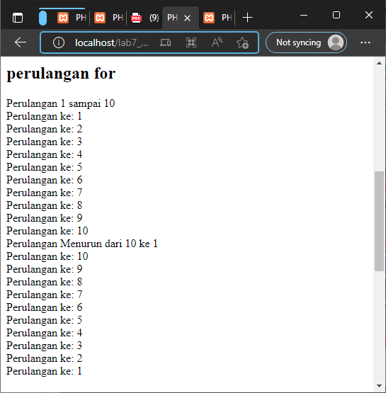

# Praktikum

- variable PHP

- predefine variable $\_GET

- membuat Form input

- operator

- kondisi IF

- kondisi switch

- perulangan for

- perulangan while

- perulangan dowhile

## Pertanyaan & Tugas

- Buatlah program PHP sederhana dengan menggunakan form input yang menampilkan nama, tanggal lahir dan pekerjaan. Kemudian tampilkan outputnya dengan menghitung umur berdasarkan inputan tanggal lahir. Dan pilihan pekerjaan dengan gaji yang berbeda-beda sesuai pilihan pekerjaan.

### JAWABAN

- berikut merupakan deklarasi form input :

- kemudian akses hasilnya melalui URL: http://localhost/lab7_php_dasar/form_input.php

- setelah itu klik submit pada form input

* berikut merupakan deklarasi hasil inputnya :

- berikut merupakan tampilan website nya :

